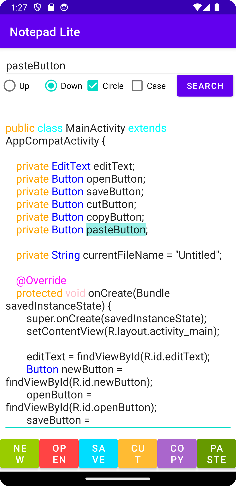
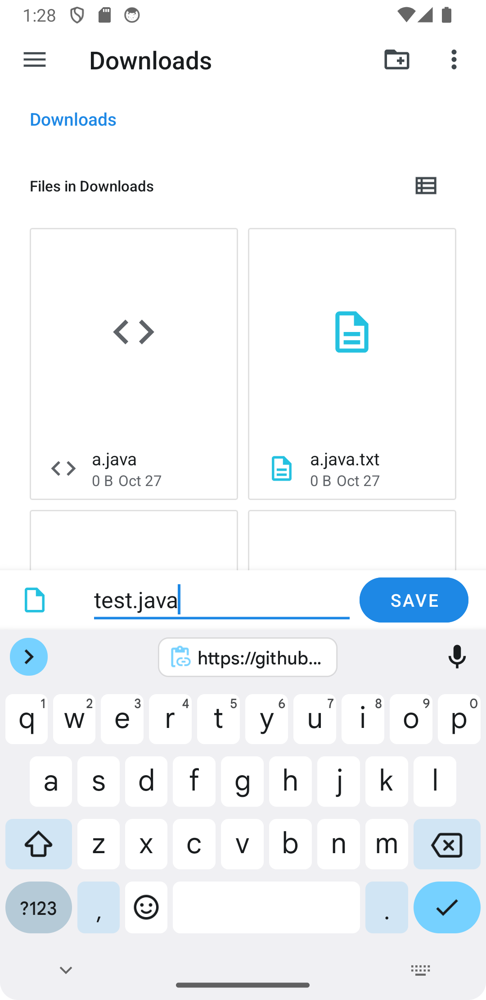

<h1>Notepad-- Mobile Version</h1>

NotepadMobile is a lightweight Android application designed for software developers with its powerful real-time syntax highlighting function. Also, it supports searching by keywords and file saving & opening. NotepadMobile could be an ideal choice for developers when using their fragile time to view and do some slight editing on their script.

  </img>
  </img>

